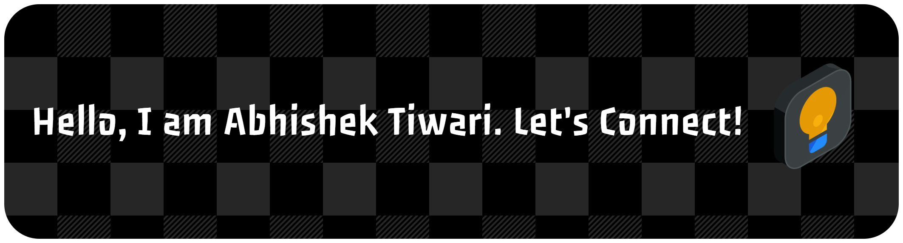

<h4 align="center">
Data Science • Machine Learning • Generative AI • Agentic AI
</h4>

🎓 M.Tech @ IME, IIT Kanpur &nbsp; | &nbsp; 💡 Building data-driven & AI-powered solutions

---

## 🚀 About Me

I’m a **Data & AI enthusiast** who enjoys turning **raw data into intelligent systems** and  
**business problems into deployable ML & GenAI solutions**.

- 🎓 **M.Tech** at **IME, IIT Kanpur**
- 🧠 Strong foundation in **Data Science, ML, Deep Learning & GenAI**
- 🤖 Hands-on experience with **RAG systems, multi-agent workflows & MLOps**
- 🎯 Passionate about **real-world impact, scalability, and clean engineering**

---

## 🛠️ Tech Stack

<table>
<tr>
<td align="center" width="120">
 <b>Python</b>
</td>
<td align="center" width="120">
 <b>SQL</b>
</td>
<td align="center" width="120">
 <b>Pandas</b>
</td>
<td align="center" width="120">
 <b>NumPy</b>
</td>
</tr>

<tr>
<td align="center" width="120">
 <b>Scikit-Learn</b>
</td>
<td align="center" width="120">
 <b>TensorFlow</b>
</td>
<td align="center" width="120">
 <b>Keras</b>
</td>
<td align="center" width="120">
 <b>PyTorch</b>
</td>
</tr>

<tr>
<td align="center" width="120">
 <b>OpenCV</b>
</td>
<td align="center" width="120">
 <b>Matplotlib</b>
</td>
<td align="center" width="120">
 <b>Jupyter</b>
</td>
<td align="center" width="120">
 <b>GitHub</b>
</td>
</tr>

<tr>
<td align="center" width="120">
 <b>LangChain</b>
</td>
<td align="center" width="120">
 <b>CrewAI</b>
</td>
<td align="center" width="120">
 <b>LangSmith</b>
</td>
<td align="center" width="120">
 <b>Weaviate</b>
</td>
</tr>

<tr>
<td align="center" width="120">
 <b>Docker</b>
</td>
<td align="center" width="120">
 <b>Streamlit</b>
</td>
<td align="center" width="120">
 <b>MLflow</b>
</td>
<td align="center" width="120">
 <b>Azure OpenAI</b>
</td>
</tr>
</table>

---

  
  

---

## 🧠 What I’m Currently Working On

- Advanced RAG architectures (evaluation, chunking strategies, hybrid search)  
- Agentic AI systems using CrewAI & LangGraph-style orchestration  
- ML systems with reproducibility & tracking (MLflow + Docker)  
- Actively looking for opportunities as a Data Scientist / ML Engineer / GenAI Engineer

---

## 📫 Connect with Me

- 💼 **LinkedIn:** [Abhishek Tiwari](https://www.linkedin.com/in/abhishek-tiwari-43403021b/)
- 📧 **Email:** abhitiwari24@iitk.ac.in

⭐ If you find my work interesting, feel free to explore my repositories and connect!
